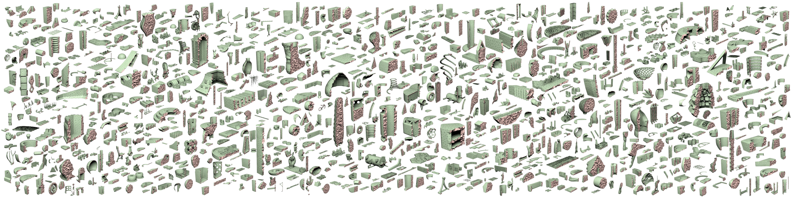

# Fast Tetrahedral Meshing in the Wild


Yixin Hu, Teseo Schneider, Bolun Wang, Denis Zorin, Daniele Panozzo.
ACM Transactions on Graphics (SIGGRAPH 2020)

```bash
@article{10.1145/3386569.3392385,
author = {Hu, Yixin and Schneider, Teseo and Wang, Bolun and Zorin, Denis and Panozzo, Daniele},
title = {Fast Tetrahedral Meshing in the Wild},
year = {2020},
issue_date = {July 2020},
publisher = {Association for Computing Machinery},
address = {New York, NY, USA},
volume = {39},
number = {4},
issn = {0730-0301},
url = {https://doi.org/10.1145/3386569.3392385},
doi = {10.1145/3386569.3392385},
journal = {ACM Trans. Graph.},
month = jul,
articleno = {117},
numpages = {18},
keywords = {mesh generation, robust geometry processing, tetrahedral meshing}
}
```

## Important Tips

👀 👀 We have the original version of "fTetWild" - TetWild. Check it out 👉 [TetWild](https://github.com/Yixin-Hu/TetWild).

👀 👀 We have a 2D version of "fTetWild" - TriWild. TriWild is able to deal with both linear and curved constraints. Now we are able to mesh curves robustly! Check it out 👉 [TriWild](https://github.com/wildmeshing/TriWild).


💡💡💡 **If you are interested in the algorithm details, please refer to our [paper](https://yixin-hu.github.io/ftetwild.pdf) first. We provide plenty of examples and statistics in the paper.**

💡💡💡 **Check our license first.**

💡💡💡 **Our algorithm is robust both in theory and in practice. If you do find fTetWild crash (on your laptop), please test it (on cluster) with more resource given. The most complex model I tested requires >32GB memory.**

💡💡💡 **The orientation of input faces is as important as the position of their vertices. Our algorithm is faithful to the input face position and orientation [check Tetwild](https://github.com/Yixin-Hu/TetWild#important-tips)**


## Dataset
Here is pre-generated tetmeshes and the extracted surface meshes for research-purpose usage. **Please kindly cite our paper when using our pre-generated data.**

- 10k Input: [Thingi10k](https://ten-thousand-models.appspot.com/)
- 10k Output:
[10k tetmeshes](https://drive.google.com/file/d/13zmGxikHiiSv9-eu8wZDTOWtPmR-KV5b/view?usp=sharing)

- Figures in the paper: [Input/output & scripts](https://drive.google.com/file/d/1qTukYF3N05jLxKxYQK5tNOUdFAr_0sf1/view?usp=sharing)

## Installation via CMake

Our code was originally developed on MacOS and has been tested on Linux and Windows. We provide the commands for installing fTetWild in MacOS:

- Clone the repository into your local machine:

```bash
git clone https://github.com/wildmeshing/fTetWild.git
```

- Compile the code using cmake (default in Release mode):

```bash
cd fTetWild
mkdir build
cd build
cmake ..
make
```

You may need to install `gmp` before compiling the code. You can install it via

- [homebrew](https://brew.sh/) on mac:
```bash
brew install gmp
```
- Package manager on Unix:
```
sudo apt-get install gmp
```
- [Conda](https://anaconda.org) on Windows:
```
conda install -c conda-forge mpir
```

**Note Windows** The executable needs that the file `mpir.dll` is in the same directiory of `FloatTetwild_bin.exe`. Once you compliled the code, copy `mpir.dll` (e.g., `<conda_dir>\Library\bin`) to the directoy containing `FloatTetwild_bin.exe`.

**Note** if cmake cannot find gmp you need to export the envirnement variable `GMP_INC` and `GMP_LIB` to the folder where you installed (e.g., `<conda_dir>\Library\include` for `GMP_INC` and `<conda_dir>\Library\lib` for `GMP_LIB`).

- Check the installation:

```bash
./FloatTetwild_bin --help
```
This command should show a list of fTetWild parameters.

## Usage

### Input/output Format

The inputs of our software are triangle surface meshes in `.off/.obj/.stl/.ply` format.

We support `.mesh/.msh` format output. The default output format is `.msh` with minimum dihedral angle recorded as element scalar field, which can be visualized by software [Gmsh](http://gmsh.info/). You can use `PyMesh::MshLoader` and `PyMesh::MshSaver` in `pymesh/` for read and write `.msh` meshes.


### Features

Our software is quite easy to use. Basically, users only need to provide a surface triangle mesh as input and our mesher would output a tetrahedral mesh by using default settings. If you want to customize your own tetmeshes, we also provide some options.

- Envelope of size *epsilon*

Using smaller envelope preserves features better but also takes longer time. The default value of *epsilon* is *b/1000*, where *b* is the length of the diagonal of the bounding box.

- Ideal edge length

Using smaller ideal edge length gives a denser mesh but also takes longer time. The default ideal edge length is *b/20*

- Filtering energy

Our mesher stops optimizing the mesh when maximum energy is smaller than filtering energy. Thus, larger filtering energy means less optimization and sooner stopping. If you do not care about quality, then give a larger filtering energy would let you get the result earlier. The energy we used here is conformal AMIPS whose range is from 3 to +inf. The default filtering energy is 10.

💡 We suggest not to set filtering energy smaller than 8 for complex input.

- Maximum number of optimization passes

Our mesher stops optimizing the mesh when the maximum number of passes is reached. The default number is 80.

- Sizing field
Users can provide a background tetmesh in .msh format with vertex scalar field values stored. The scalar field values is used for controlling edge length. The scalars inside an element of the background mesh are linearly interpolated.

💡 [Here](https://drive.google.com/file/d/1qp0iAnfGGj-NK-zkVVsvfvkG7JcZ1vNU/view?usp=sharing) is an example including input surface mesh, background mesh and output tetmeshes with/without sizing control.

- Smoothing open regions

Our method can fill gaps and holes but the tetmesh faces on those parts could be bumpy. We provide users an option to do Lapacian smoothing on those faces to get a smoother surface.

### Command Line Switches
Our software supports usage via command line or via a C++ function wrapper. Here is an overview of all command line switches:

```
RobustTetMeshing
Usage: ./FloatTetwild_bin [OPTIONS]
Options:
  -h,--help                   Print this help message and exit
  -i,--input TEXT:FILE        Input surface mesh INPUT in .off/.obj/.stl/.ply format. (string, required)
  -o,--output TEXT            Output tetmesh OUTPUT in .msh format. (string, optional, default: input_file+postfix+'.msh')
  --tag TEXT:FILE             Tag input faces for Boolean operation.
  --op INT                    Boolean operation: 0: union, 1: intersection, 2: difference.
  -l,--lr FLOAT               ideal_edge_length = diag_of_bbox * L. (double, optional, default: 0.05)
  -e,--epsr FLOAT             epsilon = diag_of_bbox * EPS. (double, optional, default: 1e-3)
  --stop-energy FLOAT         Stop optimization when max energy is lower than this.
  --log TEXT                  Log info to given file.
  --level INT                 Log level (0 = most verbose, 6 = off).
  -q,--is-quiet               Mute console output. (optional)
  --skip-simplify             skip preprocessing.
  --no-binary                 export meshes as ascii
  --no-color                  don't export color
  --smooth-open-boundary      Smooth the open boundary.
  --manifold-surface          Force the output to be manifold.
  --coarsen                   Coarsen the output as much as possible.
  --csg TEXT:FILE             json file containg a csg tree
  --disable-filtering         Disable filtering out outside elements.
  --use-floodfill             Use flood-fill to extract interior volume.
  --use-general-wn            Use general winding number.
  --use-input-for-wn          Use input surface for winding number.
  --bg-mesh TEXT:FILE         Background mesh for sizing field (.msh file).
  --epsr-tags TEXT:FILE       List of envelope size for each input faces.
  --max-threads UINT          Maximum number of threads used
```

## Acknowledgements

We used several useful libraries in our implement, testing, and rendering listed as follows. We would like to especially thank their authors for their great work and publishing the code.

- [PyMesh](https://github.com/qnzhou/PyMesh)
- [PyRenderer](https://github.com/qnzhou/PyRenderer)
- [CLI11](https://github.com/CLIUtils/CLI11)
